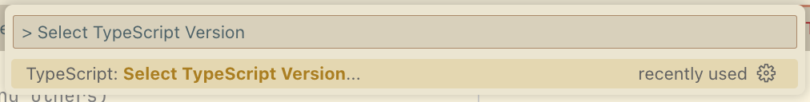
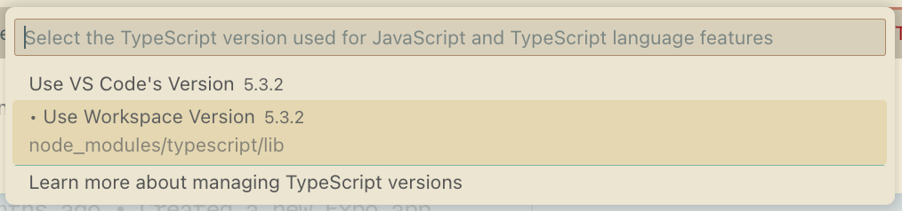

Based on: https://bsky.app/profile/did:plc:rn2ur6nqbw5hddbbw2khckhw/post/3lijkzj5nvc25

Somewhat fixes: https://github.com/microsoft/vscode/issues/204535

You might also be interested in:
https://github.com/tidalhq/ts-plugin-sort-import-suggestions

# ts-plugin-filter-suggestions

A TypeScript plugin that allows configuring filters for suggestions provided by the TypeScript Language Server. It should be compatible with any IDE or editor that utilizes the TypeScript Language Server.

|               | Before      |   After
| -----------   | ----------- | ----------- |
| Auto complete | TODO | TODO |


## Setup

- Install package

```bash
pnpm install ts-plugin-filter-suggestions
```

- Config `tsconfig.json`

```json
{
    "compilerOptions": {
    "plugins": [
        {
			"name": "ts-plugin-filter-suggestions",
			// use options from `IntellisensePluginConfig` here
			// ...

			// Defaults (everything is optional)
			"keepKeywords": true,
			"hideSuggestionsIfLessThan": 0,
			"hideCompletionsForModuleExportsIfLessThan": 4,
			"useLabelDetailsInCompletionEntriesIfLessThan": 100, // = always
			"shouldFilterWithStartWithIfLessThan": -1,
			"filterIfLessThan": 7,
			"filterIfMoreThanEntries": 12, // 12 is the number of suggestions visible in the hover tooltip before
			"preferImportFrom": [],
			"preferImportFromMode": "exclude",
			"filterMode": "exclude",
			"excludeSourceIncluding": ["/dist/", "/build/", "/src/"],
			"excludeDeprecated": true,
			"excludeUnrelevantGlobals": true,
			"includedGlobals": ["Boolean", "Number", "String", "Symbol", "Object", "Function", "Array", "Date", "Error", "RegExp", "Map", "Set", "WeakMap", "WeakSet", "Int8Array", "Uint8Array", "Uint8ClampedArray", "Int16Array", "Uint16Array", "Int32Array", "Uint32Array", "Float32Array", "Float64Array", "BigInt64Array", "BigUint64Array", "console", "window", "document", "navigator", "history", "location", "screen", "alert", "confirm", "prompt", "print", "requestAnimationFrame", "cancelAnimationFrame", "requestIdleCallback", "cancelIdleCallback", "fetch", "Headers", "Request", "Response", "FormData", "FileReader", "FileList", "Blob", "URL", "URLSearchParams", "HTMLElement", "CSSStyleSheet", "CSSRule", "CSSRuleList", "AbortSignal", "AbortController", "__dirname", "__filename", "Blob"],
			"shouldFilterWithIncludesIfLessThan": 100,  // = always
			"maxEntries": 150,
			"enableLogs": false, // mostly for me & potential contributors

			// Customization Example
			"maxEntries": 50,
			"filterIfLessThan": 6,
			"preferImportFrom": [
				{
					"prefer": "node:fs/promises",
					"insteadOf": "node:fs"
				},
				{
					"prefer": "node:fs/promises",
					"insteadOf": "fs"
				},
			],
        }
    ]
    },
}
```

- Config your Editor or IDE to use the TypeScript from node_modules (i.e. *Use Workspace Version* in VSCode from *TypeScript and JavaScript Language Features* Extension), otherwise TypeScript won't be able to load the plugin
    - 
    - 

## Configuration

```ts
export interface PreferImportFrom {
	prefer: string;
	insteadOf: string;
}

export interface IntellisensePluginConfig {
	/**
	 * Should we always keep keywords ?
	 * @default true
	 */
	keepKeywords?: boolean;
	/**
	 * Will prevent ANY suggestions from showing if current word (found on the caret position) has <= X characters
	 * use `-1` to disable this option entirely
	 * @default 0 // prevent suggestions if asking for suggestions in an empty string
	 */
	hideSuggestionsIfLessThan?: number;
	/**
	 * Maps to `ts.GetCompletionsAtPositionOptions.includeCompletionsForModuleExports` to true if current word (found on the caret position) has <= X characters
	 * use `-1` to disable this option entirely
	 * This drastistically speeds up completions at the cost of only seeing suggestions related to the current file/globals/keywords
	 *
	 * @default 4
	 * @see https://github.com/typescript-language-server/typescript-language-server/blob/184c60de3308621380469d6632bdff2e10f672fd/docs/configuration.md
	 */
	hideCompletionsForModuleExportsIfLessThan?: number;
	/**
	 * Maps to `ts.GetCompletionsAtPositionOptions.useLabelDetailsInCompletionEntries` to true if current word (found on the caret position) has <= X characters
	 * use `-1` to disable this option entirely
	 *
	 * @default 100 // = always enabled by default
	 * @see https://github.com/typescript-language-server/typescript-language-server/blob/184c60de3308621380469d6632bdff2e10f672fd/docs/configuration.md#:~:text=useLabelDetailsInCompletionEntries%20%5Bboolean%5D%20Indicates,Default%3A%20true
	 */
	useLabelDetailsInCompletionEntriesIfLessThan?: boolean;
	/**
	 * Removes (or move to the bottom) duplicated suggestions (same name, different source) from the completion list
	 * @example
	 * // You're typing `read|` and the suggestions are:
	 * - `readFile` from `node:fs`
	 * - `readFile` from `node:fs/promises`
	 *
	 * // with this option set to [{ prefer: "node:fs/promises", insteadOf: "node:fs" }] the suggestion `readFile` from `node:fs` will be removed
	 * // so that only the `readFile` from `node:fs/promises` will be shown
	 *
	 * @default []
	 */
	preferImportFrom?: PreferImportFrom[];
	/**
	 * Allows to either completely remove duplicated suggestions (same name, different source) or move them last
	 * @default "exclude"
	 */
	preferImportFromMode?: "exclude" | "sort-last";
	/**
	 * Allows to either completely remove filtered suggestions or move them last
	 * @default "exclude"
	 */
	filterMode?: "exclude" | "sort-last";
	/**
	 * Filter suggestions if the current word (found on the caret position) has <= X characters
	 * @default 7
	 */
	filterIfLessThan?: number;
	/**
	 * Filter suggestions only if the number of suggestions is >= X
	 * @default 12
	 */
	filterIfMoreThanEntries?: number;
	/**
	 * Exclude suggestions from the completion list if the source contains any of the following strings
	 *
	 * @example
	 * ```
	 * excludeSourceIncluding: ["/dist/", "/build/", "/src/", "/fp/"]
	 * ```
	 *
	 * will exclude suggestions from the completion list such as:
	 * - import { flushAddSourceMiddleware } from '@segment/analytics-next/dist/types/core/buffer';
	 * - import { startOfSecond } from 'date-fns/fp/startOfSecond';
	 * - import { zodResolver } from '@hookform/resolvers/zod/src/zod.js';
	 * - import { A } from 'vitest/dist/chunks/environment.LoooBwUu.js';
	 * - import Ajv from 'ajv/dist/core';
	 *
	 * @default []
	 */
	excludeSourceIncluding?: string[];
	/**
	 * Anything marked as `@deprecated` will be excluded from the completion list
	 * @default true
	 */
	excludeDeprecated?: boolean;
	/**
	 * Exclude globals that are not relevant for the current file
	 *
	 * a global is identified with `entry.kindModifier === declare && kind === declarations|var|alias|function|const|module`
	 * @default true
	 */
	excludeUnrelevantGlobals?: boolean;
	/**
	 * Globals that SHOULD BE included (exceptions of `excludeUnrelevantGlobals`) in the completion list
	 * @default ["Boolean", "Number", "String", "Symbol", "Object", "Function", "Array", "Date", "Error", "RegExp", "Map", "Set", "WeakMap", "WeakSet", "Int8Array", "Uint8Array", "Uint8ClampedArray", "Int16Array", "Uint16Array", "Int32Array", "Uint32Array", "Float32Array", "Float64Array", "BigInt64Array", "BigUint64Array", "console", "window", "document", "navigator", "history", "location", "screen", "alert", "confirm", "prompt", "print", "requestAnimationFrame", "cancelAnimationFrame", "requestIdleCallback", "cancelIdleCallback", "fetch", "Headers", "Request", "Response", "FormData", "FileReader", "FileList", "Blob", "URL", "URLSearchParams", "HTMLElement", "CSSStyleSheet", "CSSRule", "CSSRuleList", "AbortSignal", "AbortController", "__dirname", "__filename", "Blob"]`
	 */
	includedGlobals?: string[];
	/**
	 * Filter suggestions using `suggestion.name.toLowerCase().startsWith(currentWord.toLowerCase())` if the current word (found on the caret position) has <= X characters
	 * @default -1 // = never, disabled by default
	 */
	shouldFilterWithStartWithIfLessThan?: number;
	/**
	 * Filter suggestions using `suggestion.name.toLowerCase().includes(currentWord.toLowerCase())` if the current word (found on the caret position) has <= X characters
	 * @default 100 // = always enabled by default
	 */
	shouldFilterWithIncludesIfLessThan?: number;
	/**
	 * Limits the number of suggestions returned
	 * @default 150
	 */
	maxEntries?: number;
	/**
	 * Enables logs
	 * @default false
	 */
	enableLogs?: boolean | "info" | "debug";
}

```

## Development

Please refer to [TypeScript / Writing a TypeScript Plugin](https://github.com/microsoft/TypeScript/wiki/Writing-a-Language-Service-Plugin)
